# Auto-Quiz

## Game Overview

Auto quiz games it is a game that consist of 10 question about Cars, auto business etc. 

Please see live programm here [Auto-Quiz](https://auto-trivia.herokuapp.com/)

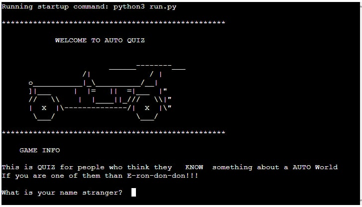

# Contents
- [How to Play](#how-to-play)
- [User Experience](#user-experience)
- [Owner goals](#owner-goals)
- [Model](#model)
- [Features](#features)
    - [User name](#user-name)
    - [Start](#start)
    - [Exit](#exit)
    - [Questions](#questions)
    - [Response](#response)
    - [End game](#end-game)
- [PEP8 online](#pep8-online)
- [Input Testing](#Input Testing)
- [Deploy the project to Heroku](#deploy-the-project-on-heroku)
- [Credit](#credit)
- [Acknowledgement](#acknowledgement)

## How to play

    This Quiz is very straight forward. We have welcoming message at the begginig and afterwards we can see that computer ask users name.
    Once computer have our name we got question if we want to start the game. Once we want to we have 10 questions hwere if user would reply incorrect he would see message "CORRECT" or "WRONG" and ammount of points he got after that.

[Back to top](#Auto-Quiz)

## User Experience

    As a first time user, I want game that easy to understand.
    As a first time user, I want to understand how to play.
    As a game user, I want to see my score.
    As a Game user I want to see if I am correct ot not.

[Back to top](#Contents)

## Owner goals

    Provide easy and time spending for some short amoint of time.

### Model

#### Logic Flow Chart

    Logic was made by ***Lucidchart***
    
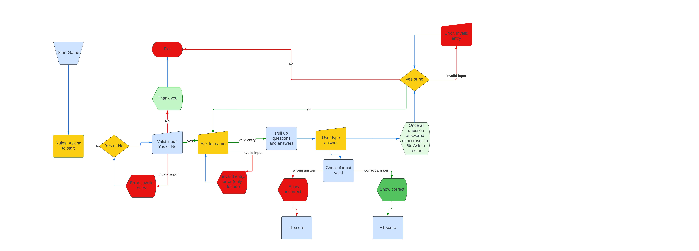

[Back to top](#Auto-Quiz)

## Features

    Quiz game that shows you questions in different order and user score in the end of the game

### User name

    At the beggining asks user name

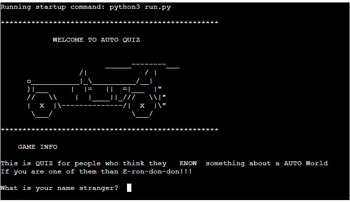

[Back to top](#Contents)

### Start 

    Show Welcoming message, car graphic and asks the name of the user. after which he would be asked again if he want continue.

[Back to top](#Contents)

### Exit 

    Once user decided not to go further than game exits

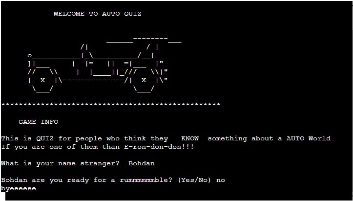

[Back to top](#Contents)

### Questions 

    After User choose 'yes' we can see questions

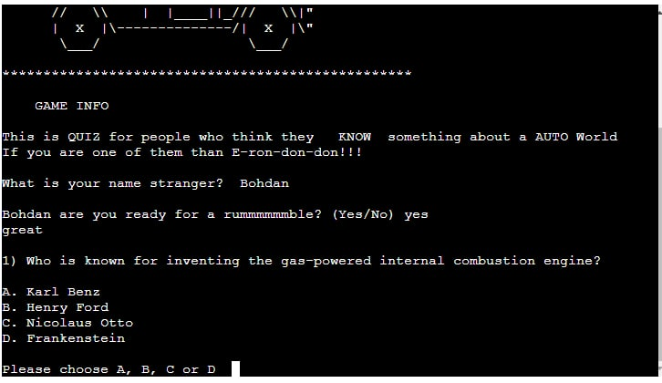

[Back to top](#Contents)

### Response

    Once User start to play he/she would see if answer is correect by 'correct' or wrong once 'wrong' and as well score

    Correct

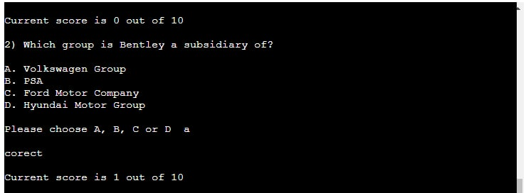

    Wrong

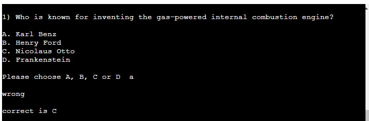

[Back to top](#Contents)

### End game

    Once user gives answer for all questions message will tell him that he replyied for everthing

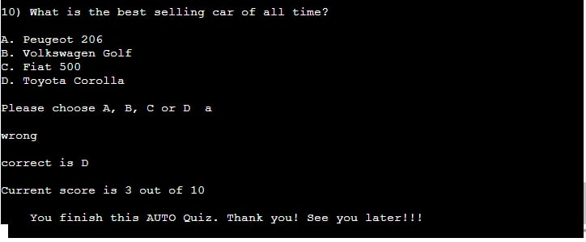

[Back to top](#Contents)

## Technologies Used

    [GitHub]() - to host code and update versions
    [Python]() - coding language
    [Heroku]() - deployment.
    [Chrome DevTools]() - to test the responsiveness.
    [PEP8 online]() - to validation
    [Lucidchart]() - to create the flow chart.

[Back to top](#Contents)

## Testing

### PEP8 online

    Code wa tested in  [PEP8](http://pep8online.com/) and no errors found

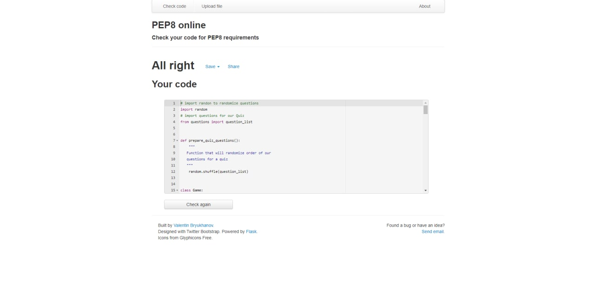

[Back to top](#Contents)

### Input Testing

    I tested all project manually typing in all possible ways

    If name is numbers User would see this

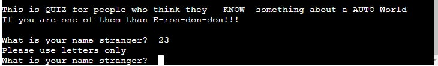

    Same message would pop up for any invalid User input

[Back to top](#Contents)

### Deploy the project to Heroku

    1. Log in account at Heroku account , Choose `Create new app`, name your app, choose a `region` from the  list to which one is better for you`.  Click `Create app`.
  
    2. Go to the `Settings`  , click `Add buildpack` button at``Buildpacks section`, first Choose `python` and add it, then select `nodejs` and add it.

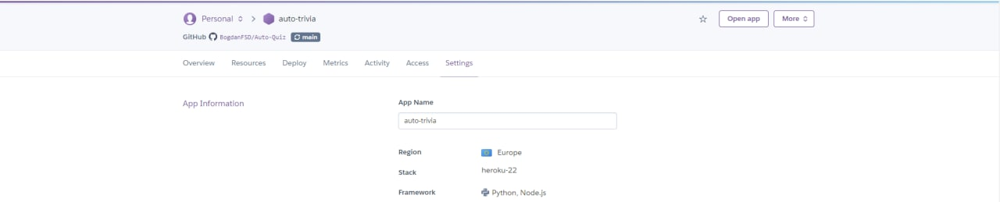

    3. Click on `Deploy` , click `GitHub` in the `Deployment method` section, search for the repo at your GitHub, click``Connect`. 

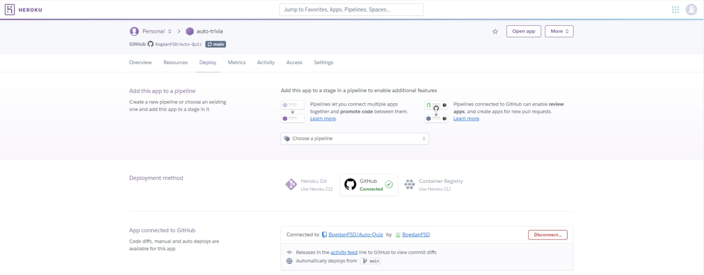

    4. In the `Manual deploy`, choose `main` and then click `Deploy Branch` button, the app will deploy soon. 

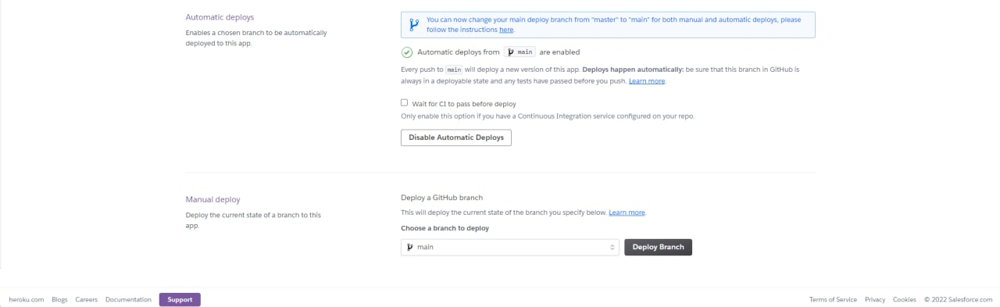

    5. Click the `View` button at the bottom  or the `Open app` button  to view the programme.

[Back to top](#Contents)

## Credit

I watche this video that helped me better to implenement classes [Mike Dane](https://www.youtube.com/watch?v=SgQhwtIoQ7o&ab_channel=MikeDane)

I used some code from here as well [Real  Python](https://realpython.com/python-quiz-application/)

[Back to top](#Contents)

## Acknowledgement

    Thank you to my Mentor Rohit Sharma and Slack community

[Back to top](#Contents)

